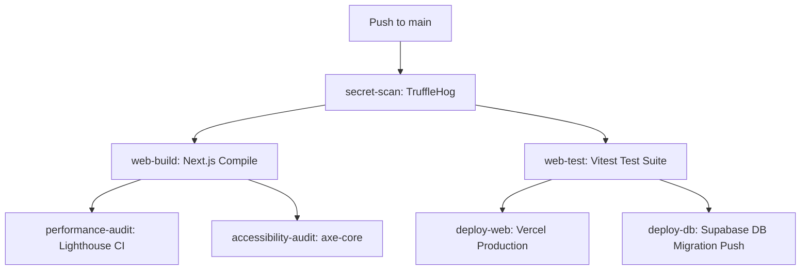

# ScholarMe — Enterprise Academic & Honor Society Management Platform

[](https://github.com/PerpyVanitas/ScholarMe/actions)
[]()
ScholarMe is a full-stack, enterprise-grade academic management and peer-learning platform built for honor society organizations. It serves as a unified digital infrastructure for managing tutoring operations, organizational finances, AI-powered spaced repetition learning, digital member identity, physical and digital library cataloging, real-time community engagement, and executive administration.

---

## 📖 Table of Contents

- [Overview & Mission](#overview--mission)
- [Documentation](#documentation)
- [Comprehensive Feature Architecture](#comprehensive-feature-architecture)
  - [1. Authentication & Dual-Mode Identity System](#1-authentication--dual-mode-identity-system)
  - [2. Profiles, Onboarding & Digital ID Cards](#2-profiles-onboarding--digital-id-cards)
  - [3. Peer Learning Center (PLC) & Tutoring Engine](#3-peer-learning-center-plc--tutoring-engine)
  - [4. AI Study Suite, Flashcards & Spaced Repetition (SRS)](#4-ai-study-suite-flashcards--spaced-repetition-srs)
  - [5. Physical & Digital Resource Repository](#5-physical--digital-resource-repository)
  - [6. Community, Messaging & Peer Networking Hub](#6-community-messaging--peer-networking-hub)
  - [7. Gamification, Leveling & Progression System](#7-gamification-leveling--progression-system)
  - [8. Executive Finance & SCARDS Accounting Module](#8-executive-finance--scards-accounting-module)
  - [9. Teamwork & Deliverables Tracker](#9-teamwork--deliverables-tracker)
  - [10. IT Command Center & System Administration](#10-it-command-center--system-administration)
  - [11. Automated Reminders, Cron Sweeps & Webhooks](#11-automated-reminders-cron-sweeps--webhooks)
- [Role-Based Access Control (RBAC) Architecture](#role-based-access-control-rbac-architecture)
  - [Two-Layer Role Hierarchy](#two-layer-role-hierarchy)
  - [The Four Status Layers](#the-four-status-layers)
  - [Position Exclusivity & Singleton Controls](#position-exclusivity--singleton-controls)
- [Domain-Driven Design (DDD) Project Structure](#domain-driven-design-ddd-project-structure)
- [Database Schema & Architecture](#database-schema--architecture)
  - [Core Database Tables](#core-database-tables)
  - [Database Triggers & Automated Logic](#database-triggers--automated-logic)
  - [Row Level Security (RLS) Policy System](#row-level-security-rls-policy-system)
- [Technology Stack](#technology-stack)
- [Getting Started & Local Setup](#getting-started--local-setup)
  - [Prerequisites](#prerequisites)
  - [Step-by-Step Installation](#step-by-step-installation)
  - [Environment Variables Matrix](#environment-variables-matrix)
- [Development, Testing & Code Quality](#development-testing--code-quality)
  - [Command Reference](#command-reference)
  - [Automated Testing Suite](#automated-testing-suite)
- [CI/CD & Security Automation Pipeline](#cicd--security-automation-pipeline)
- [Scale & High-Concurrency Engineering](#scale--high-concurrency-engineering)
- [Contributing & Code Standards](#contributing--code-standards)

---

## Documentation

Full project documentation has been consolidated into the `docs/` folder. Key entry points:
- [API Documentation](docs/API.md)
- [Architecture & Map](docs/map.md)
- [Database Schema](docs/schema.md)
- [RBAC Architecture](docs/rbac.md)
- [Incident Response Runbook](docs/INCIDENT_RESPONSE.md)
- [Agent Task Spec](docs/ScholarMe_Agent_Task_Spec.md)

---

## Overview & Mission

ScholarMe replaces disjointed spreadsheets, paper sign-in sheets, manual session scheduling, and external financial logs with an integrated web platform. The system is engineered around four primary operational user roles:

1. **Learners (External & Members)** — Browse and book certified tutors, request office hours, participate in study groups, attempt AI-generated quizzes, practice flashcards with Spaced Repetition (SM-2), track daily learning streaks, and maintain a digital identity.
2. **Tutors (Honor Society Members & ESAS Scholars)** — Manage weekly availability, handle session requests, request session transfers/substitutions, clock into timesheets at the Peer Learning Center, track service hours, and build a verified academic portfolio.
3. **Executive Officers & Committee Heads** — Submit and review activity budget requests, process petty cash disbursements, liquidate receipts using AI OCR parsing, co-sign SCARDS audit summary reports, assign committee tasks, and monitor member progression.
4. **Administrators & Super Admins** — Oversee platform security, manage annual officer term assignments, run physical QR identity kiosks, audit raw system telemetry logs, configure organizational white-labeling, and maintain database security policies.

---

## Comprehensive Feature Architecture

### 1. Authentication & Dual-Mode Identity System

- **Dual-Mode Authentication Flow**:
  - _Standard Web Authentication_: Supabase Auth (Email/Password or OAuth providers like Google and Microsoft) utilizing `@supabase/ssr` for secure server-side cookie management and session refresh in middleware.
  - _Kiosk QR / Card ID Authentication_: Designed for physical check-in kiosks at the Peer Learning Center (PLC). Users authenticate via Card ID + PIN.
- **HMAC-SHA256 QR Security**:
  - Digital ID card QR codes encode an HMAC-SHA256 signature payload (`{ cardId, sig }`) derived from the user's ID, PIN, and server secret key. This completely prevents plaintext PIN exposure in printed or digital QR codes.
  - Verification API (`/api/v1/auth/card-login`) utilizes `crypto.timingSafeEqual` to prevent timing attacks.
- **Brute-Force & Rate-Limiting Protection**:
  - Card login endpoints are rate-limited via a Supabase-backed sliding-window rate limiter (`increment_rate_limit` RPC) allowing a maximum of 10 attempts per 10 minutes per IP/card ID.
- **Strict Password Complexity**:
  - Enforces Supabase auth security rules: minimum 8 characters, uppercase, lowercase, numbers, and special symbols across sign-up, sign-in, and password updates.

### 2. Profiles, Onboarding & Digital ID Cards

- **Guarded Multi-Step Onboarding**:
  - First-time users are automatically routed through a 3-step setup wizard requiring Terms acceptance, full profile information, degree program, and academic year level.
  - Unfinished profiles are strictly gated; middleware continuously redirects un-onboarded routes back to `/onboarding`.
- **Dynamic Digital ID Card**:
  - Renders user details: full name, profile photo, unique membership number (e.g., `MJJ-2627-0001`), degree program, year level, Honor Society designation badge, level title, and current academic year.
  - Includes a live, styled QR code powered by `qrcode.react` for rapid scanning.
- **Mastery Verifications**:
  - Tutors can upload official academic transcripts or certificates to Supabase Storage. Admins can view signed document previews and verify subject mastery claims.

### 3. Peer Learning Center (PLC) & Tutoring Engine

- **Tutor Discovery & Filtering**:
  - Browse tutors by subject, specialization, rating, and real-time availability. Search algorithms automatically filter out Admin/Learner accounts.
- **Flexible Session Booking**:
  - _1-on-1 Sessions_: Learners choose subject, prep notes, and available time slots.
  - _Group Sessions_: Learners can set `max_participants` (up to 5) for collaborative study.
  - _Office Hours_: Tutors can mark open drop-in group sessions as Office Hours.
  - _Recurring Sessions_: Tutors can approve 4-week recurring session blocks.
- **Session Substitutions & Transfers**:
  - If a tutor cannot attend a scheduled session, they can issue a transfer request to a peer tutor. The receiving tutor accepts or declines via their dashboard.
- **Learner Waitlists & Open Groups**:
  - Learners can browse "Open Group Sessions" to join directly or enter a FIFO waitlist when sessions are full.
- **Timesheets & Service Hour Tracking**:
  - ESAS Scholars and tutors clock in/out at the PLC. Timesheet entries track active duration; automatic nightly cron jobs sweep for open shifts exceeding 12 hours.

### 4. AI Study Suite, Flashcards & Spaced Repetition (SRS)

- **AI-Powered Generation**:
  - _Local AI (WebLLM)_: Runs entirely inside the browser web worker (`WebWorkerMLCEngine`) using local LLMs (e.g. Llama-3/Phi-3) for free, zero-API-cost question generation.
  - _Cloud Fallback_: Server-side Google Cloud Vertex AI integration for deep document ingestion with strict sliding-window rate limiting (2 requests/min).
- **Spaced Repetition System (SM-2 Algorithm)**:
  - Flashcard reviews use the SuperMemo-2 (SM-2) algorithm. Users rate response difficulty (_Again_, _Hard_, _Good_, _Easy_), updating interval days, ease factors, and next review timestamps.
- **Image Occlusion Editor**:
  - Upload diagrams or anatomy images and draw bounding masks over target labels. In study mode, users click masks to reveal hidden answers.
- **Multi-Modal Study Features**:
  - Supports Text-to-Speech (TTS) reading, exact-match Typing Mode, and Anki/Quizlet CSV exports.

### 5. Physical & Digital Resource Repository

- **Digital Document Library**:
  - Upload PDFs, documents, and reference materials. File visibility can be set to public or restricted to authenticated Honor Society members.
  - PDF previews render using browser `<object>` embedding with direct download fallbacks.
- **CFMR Physical Library Inventory**:
  - Tracks physical books, calculators, and equipment inventory.
  - Includes a web-cam barcode scanner (`html5-qrcode`) for quick ISBN scanning.
  - Admins process checkouts and returns with due date tracking.
- **Interactive Campus Map**:
  - Visual modal directing members to physical resource storage locations and the Peer Learning Center.

### 6. Community, Messaging & Peer Networking Hub

- **Direct & Group Messaging**:
  - Real-time 1-on-1 and group chats powered by Supabase Realtime (`postgres_changes`).
  - Supports read receipts, pinned messages, threaded replies, and file attachments.
- **Organization Discussion Forums**:
  - Discussion boards supporting posts, multi-level replies, and upvoting.
  - _Moderation Queue_: Users can flag inappropriate posts. Admins review reported content in a dedicated Mod Queue.
- **Peer Matching Algorithms**:
  - _Study Buddies_: Matches students taking similar courses within the same degree program.
  - _Alumni Directory_: Connects current students with graduated Honor Society alumni.
- **Live Support Chat**:
  - Floating support widget connecting users directly to online Super Admins.

### 7. Gamification, Leveling & Progression System

- **Leveling Formula**:
  $$\text{Level} = \lfloor 0.1 \times \sqrt{\text{Total XP}} \rfloor + 1$$
- **XP Earning Mechanics**:
  - Completed Tutoring Session: +50 XP / hour (credited instantly via database trigger `tutor_analytics_trigger`).
  - Study Set Creation: +15 XP.
  - Perfect Quiz Attempt: +25 XP.
  - Daily Login Streak: Scaled XP bonus per consecutive day.
- **Leaderboards & Hall of Fame**:
  - Real-time global leaderboards for students and tutors.
  - Postgres RPC functions (`hall_of_fame_rpc`) surface standout tutors across weekly, monthly, and all-time hours.
- **Badges & Visual Titles**:
  - Unlocks visual badges (e.g. _Night Owl_, _7-Day Streak_, _Master Tutor_) and customized avatar borders based on tier.

### 8. Executive Finance & SCARDS Accounting Module

- **Executive Approval Hierarchy**:
  - High-value budget requests (>$5,000) strictly require final digital sign-off from the `president`. System admins cannot override executive finance locks.
- **Financial Workflows**:
  - _Budget Requests_: Multi-stage approval (`draft → pending_review → approved → released → liquidated`).
  - _Petty Cash_: Small expenditure requests capped at $300 per 24 hours to prevent budget splitting.
  - _AI Receipt Ingestion_: Automatic Google Cloud Document AI OCR parsing extracts vendor name, transaction date, and total cost from uploaded receipts.
  - _Liquidations_: Submit receipts against released budgets. Prevents new budget creation if liquidations are overdue.
- **SCARDS & Auditing**:
  - Aggregated Summary Cards co-signed by Treasurer and Auditor. Exportable as PDF summaries.

### 9. Teamwork & Deliverables Tracker

- **Kanban Board**:
  - Track committee tasks across `todo`, `in_progress`, and `done` columns.
  - Filter tasks by committee tag, deadline, and assigned officer.
- **Schedule Planner**:
  - Members log upcoming event dates and committee activities.

### 10. IT Command Center & System Administration

- **User & Access Management**:
  - View all registered accounts, change roles inline, manage suspensions, and issue physical ID cards.
- **Org Structure & Officer Term Expirations**:
  - Toastmasters-style assignment page for the 5 Executive slots and 18 Committee Head slots (11 Main + 7 ESAS).
  - Terms automatically expire on June 30 of each academic year.
- **Identity Scanner**:
  - Integrated camera QR scanner for PLC officers to check in students and log attendance.
- **System Health & Telemetry**:
  - Live metric counters (active users, total sessions, database row counts) and interactive log audit viewer.
- **Super Admin Operations**:
  - Account impersonation, system feedback review, and full database trigger management.

### 11. Automated Reminders, Cron Sweeps & Webhooks

- **Serverless Cron Sweeps (`/api/v1/admin/cron/reminders`)**:
  - Runs automated sweeps for upcoming Event RSVPs, overdue book checkouts, and expired officer roles.
- **Discord Webhook Integration**:
  - Dispatches automated system digests (new member signups, daily attendance summaries, cron completion status) to configured Discord channels.

---

## Role-Based Access Control (RBAC) Architecture

ScholarMe implements a **Two-Layer Role Model** combining system administrative access with organizational roles.

### Two-Layer Role Hierarchy

```
super_admin (System Level - Max 1)
    └── administrator (System Level - Unlimited)
          └── president (Executive - Max 1)
                └── vice_president (Executive - Max 1)
                      └── secretary / treasurer / auditor (Executive - Max 1 each)
                            └── committee_head (Committee Level - Max 1 per committee)
                                  └── assistant_committee_head (Committee Level - Max 1 per committee)
                                        └── tutor (Regular Member / ESAS Scholar)
                                              └── learner (External Student)
```

### The Four Status Layers

A single user identity is assembled from four concurrent layers:

| Layer                            | Database Field                       | Values                              | Exclusivity & Expiration                      |
| :------------------------------- | :----------------------------------- | :---------------------------------- | :-------------------------------------------- |
| **1. Account Type**              | `roles.name`                         | `learner` or `tutor` tier           | Mutually exclusive at account creation        |
| **2. Membership Classification** | `profiles.membership_classification` | `regular_member`, `esas_scholar`    | Stacks on top of tutor-tier roles             |
| **3. Org Position**              | `org_assignments.position`           | `president`, `committee_head`, etc. | Single active assignment; **Expires June 30** |
| **4. System Role Overlay**       | `profiles.role_id`                   | `administrator`, `super_admin`      | Granted independently by Super Admin          |

### Position Exclusivity & Singleton Controls

- **`super_admin` Singleton**: Strictly enforced via a PostgreSQL partial unique index (`trg_enforce_single_super_admin`). Only one user can hold this role system-wide.
- **Executive Singletons**: `president`, `vice_president`, `secretary`, `treasurer`, and `auditor` can each be held by only one person at a time per academic term.
- **Committee Head Singletons**: Maximum of 1 `committee_head` and 1 `assistant_committee_head` per committee across the 18 defined committees (11 Main, 7 ESAS).

---

## Domain-Driven Design (DDD) Project Structure

ScholarMe uses a Domain-Driven Design feature structure under `/features` to isolate domain logic and eliminate component sprawl:

```
ScholarMe/
├── app/                          # Next.js App Router (Pages & API Handlers)
│   ├── actions/                  # Global Next.js Server Actions
│   ├── api/                      # REST API Endpoints & Webhooks
│   ├── auth/                     # Sign-in, Sign-up, and OAuth Callbacks
│   └── dashboard/                # Role-Gated Dashboard Views
├── components/                   # Shared UI primitives (shadcn/ui & Radix)
│   ├── ui/                       # Buttons, Cards, Dialogs, Inputs
│   └── app-sidebar.tsx           # Role-aware navigation sidebar
├── docs/                         # OpenAPI specs, Runbooks, and Compliance Docs
├── documentation/                # Schema, RBAC, API, and Changelog specifications
│   ├── CHANGELOG.md              # Complete version history
│   ├── map.md                    # Interaction map
│   ├── rbac.md                   # Authoritative access rules
│   └── schema.md                 # Database schema definition
├── features/                     # Domain-Driven Core Modules
│   ├── admin/                    # User management, Org structure, Logs, Health
│   ├── events/                   # Calendar, RSVPs, and Announcement components
│   ├── finance/                  # Budget requests, Petty cash, Liquidations, SCARDS
│   ├── gamification/             # XP math, Leaderboards, Streaks, Daily Quests
│   ├── onboarding/               # Setup wizard and profile completion gating
│   ├── profiles/                 # Profile edit forms, Security, Digital ID cards
│   ├── quizzes/                  # AI Quiz generator, Flashcards, Image Occlusion
│   ├── sessions/                 # Tutoring booking, Waitlists, Substitutions
│   └── tutors/                   # Availability grid, Analytics, WebLLM AI Tutor
├── hooks/                        # Custom React hooks (useAuth, useRealtime, etc.)
├── lib/                          # Core Utilities & Infrastructure
│   ├── logger.ts                 # Pino structured JSON logger
│   ├── rate-limit.ts             # Supabase sliding-window rate limiter
│   ├── security/                 # HMAC QR signing and token verification
│   ├── supabase/                 # Browser, Server, and Service-Role client factories
│   └── types.ts                  # Centralized TypeScript definitions
├── public/                       # Static web assets & PWA manifest
├── scripts/                      # Maintenance & seed scripts
├── supabase/
│   └── migrations/               # Chronological SQL migration files (14-digit timestamps)
└── __tests__/                    # Vitest integration and security test suite
```

---

## Database Schema & Architecture

ScholarMe runs on PostgreSQL hosted on Supabase.

### Core Database Tables

| Category              | Primary Tables                                                                                           | Functional Purpose                                                                     |
| :-------------------- | :------------------------------------------------------------------------------------------------------- | :------------------------------------------------------------------------------------- |
| **Identity & RBAC**   | `profiles`, `roles`, `org_terms`, `org_assignments`, `auth_cards`                                        | Identity records, system overlay roles, officer assignments, and kiosk PINs.           |
| **Operations**        | `tutor_profiles`, `tutor_availability`, `sessions`, `session_waitlists`, `timesheets`, `attendance_logs` | Tutoring availability, booking lifecycles, waitlist queues, and PLC clock-ins.         |
| **Learning & AI**     | `study_sets`, `study_set_items`, `quiz_attempts`, `user_uploads`, `resource_embeddings`                  | Flashcard items, SM-2 SRS data, quiz scores, image occlusion masks, vector embeddings. |
| **Library Inventory** | `resources`, `physical_resources`, `resource_checkouts`                                                  | Digital resource uploads and CFMR physical book inventory tracking.                    |
| **Community**         | `conversations`, `messages`, `forum_posts`, `forum_reports`, `friends`, `study_groups`                   | DMs, realtime chat, forum posts, moderation reports, and peer networking.              |
| **Gamification**      | `xp_logs`, `user_achievements`, `weekly_challenges`                                                      | Audit log of XP transactions, unlocked badges, and active challenges.                  |
| **Finance**           | `finance_budget_requests`, `finance_petty_cash`, `finance_liquidations`, `finance_scards`                | Budget requests, petty cash logs, receipt liquidations, and SCARDS audit summaries.    |

### Database Triggers & Automated Logic

- **`trg_enforce_single_super_admin`**: Prevents multiple rows in `profiles` from holding the `super_admin` role concurrently.
- **`tutor_analytics_trigger`**: Automatically increments `total_sessions_completed` and credits +50 XP per hour on session completion.
- **`calculate_xp_curve`**: Computes user level dynamically based on accumulated XP.
- **`increment_rate_limit`**: Handles atomic array operations for sliding-window API rate limiting.

### Row Level Security (RLS) Policy System

RLS is enabled across 100% of public tables containing application or user data. Key policy patterns include:

- **`resource_embeddings`**: Users can view, insert, update, and delete only their owned embeddings (`auth.uid() = profile_id`).
- **`finance_*`**: Write operations restricted to `treasurer`, `auditor`, `president`, and `administrator` roles.
- **`physical_resources`**: Public read access; write operations restricted to Officers and Admins.

---

## Technology Stack

- **Core Framework**: Next.js 16.2 (App Router, Server Actions, Serverless API Routes)
- **Programming Language**: TypeScript 5.7 (`strict: true` enforced)
- **Frontend Engine**: React 19 + Tailwind CSS v4
- **Database & Auth**: Supabase PostgreSQL, Supabase Auth (`@supabase/ssr`), Supabase Realtime
- **Design System**: shadcn/ui + Radix UI Primitives + Lucide React Icons
- **AI Processing**: Local On-Device AI (`@mlc-ai/web-llm` in Web Worker) + Google Cloud Vertex AI & Document AI
- **Form Management**: React Hook Form + Zod Validation
- **Logging & Security**: Pino Structured Logger + HMAC-SHA256 Token Signing + Bcrypt PIN Hashing
- **Hardware Integration**: `html5-qrcode` (webcam scanning) + `qrcode.react` (QR generation)
- **Testing Suite**: Vitest + React Testing Library + Playwright E2E

---

## Getting Started & Local Setup

### Prerequisites

- **Node.js**: `v24.0.0` or higher
- **Package Manager**: `pnpm` (required)
- **Database**: Supabase PostgreSQL project

### Step-by-Step Installation

1. **Clone the Repository**:

   ```bash
   git clone https://github.com/PerpyVanitas/ScholarMe.git
   cd ScholarMe
   ```

2. **Install Dependencies**:

   ```bash
   pnpm install
   ```

3. **Configure Environment Variables**:
   Create a `.env.local` file in the project root:

   ```bash
   cp .env.example .env.local
   ```

4. **Apply Database Migrations**:

   ```bash
   npx supabase db push --include-all
   ```

5. **Launch the Development Server**:
   ```bash
   pnpm run dev
   ```
   Open [http://localhost:3000](http://localhost:3000) in your browser.

### Environment Variables Matrix

| Variable                        | Required | Description                                         |
| :------------------------------ | :------: | :-------------------------------------------------- |
| `NEXT_PUBLIC_SUPABASE_URL`      |   Yes    | Your Supabase project URL                           |
| `NEXT_PUBLIC_SUPABASE_ANON_KEY` |   Yes    | Supabase public anonymous key                       |
| `SUPABASE_SERVICE_ROLE_KEY`     |   Yes    | Supabase service-role secret key (Server side only) |
| `NEXT_PUBLIC_APP_URL`           |   Yes    | Canonical root URL (e.g. `http://localhost:3000`)   |
| `CARD_TOKEN_SECRET`             |   Yes    | Secret key for HMAC-SHA256 QR card signing          |
| `GEMINI_API_KEY`                | Optional | Fallback cloud AI key for document generation       |
| `DISCORD_WEBHOOK_URL`           | Optional | Discord webhook URL for system digests              |
| `RESEND_API_KEY`                | Optional | Resend API key for transactional emails             |

---

## Development, Testing & Code Quality

### Command Reference

```bash
# Start local development server
pnpm run dev

# Type-check TypeScript codebase without emitting files
npx tsc --noEmit

# Run unit and integration tests via Vitest
pnpm run test

# Run tests in watch mode
pnpm run test:watch

# Execute security regression suite
pnpm run test:security

# Run ESLint check
pnpm run lint

# Format code with Prettier
pnpm run format

# Execute production build validation
pnpm run build
```

### Automated Testing Suite (SSD Compliance Matrix)

The project maintains a Security test suite covering Secure Software Development (SSD) requirements:

| Security Feature | Status | Test File |
| :--- | :---: | :--- |
| HMAC-SHA256 QR Signatures | ✅ Passing | [`card-token.test.ts`](__tests__/security/card-token.test.ts) |
| Brute-Force Rate Limiting | ✅ Passing | [`card-login-rate-limit.test.ts`](__tests__/security/card-login-rate-limit.test.ts) |
| Password Reset Rate Limiting | ✅ Passing | [`password-reset-rate-limit.test.ts`](__tests__/security/password-reset-rate-limit.test.ts) |
| PIN Hashing | ✅ Passing | [`pin-hashing.test.ts`](__tests__/security/pin-hashing.test.ts) |
| Cross-Site Scripting (XSS) Sanitization | ✅ Passing | [`xss-sanitization.test.ts`](__tests__/security/xss-sanitization.test.ts) |
| Cross-Site Request Forgery (CSRF) & Origin | ✅ Passing | [`csrf-origin.test.ts`](__tests__/security/csrf-origin.test.ts) |
| Content Security Policy (CSP) Headers | ✅ Passing | [`csp-headers.test.ts`](__tests__/security/csp-headers.test.ts) |
| Row Level Security (RLS) Enforcements | ✅ Passing | [`rls-profiles.test.ts`](__tests__/security/rls-profiles.test.ts) |
| Storage Bucket RLS | ✅ Passing | [`storage-rls.test.ts`](__tests__/security/storage-rls.test.ts) |
| BOLA / IDOR Protection | ✅ Passing | [`bola-idor.test.ts`](__tests__/security/bola-idor.test.ts) |
| Admin Route Protection | ✅ Passing | [`admin-route-protection.test.ts`](__tests__/security/admin-route-protection.test.ts) |
| RAG Prompt Injection Prevention | ✅ Passing | [`rag-prompt-injection.test.ts`](__tests__/security/rag-prompt-injection.test.ts) |
| SQL Injection (Exec-SQL Access) | ✅ Passing | [`exec-sql-access.test.ts`](__tests__/security/exec-sql-access.test.ts) |
| Account Enumeration | ✅ Passing | [`account-enumeration.test.ts`](__tests__/security/account-enumeration.test.ts) |

- **Spaced Repetition Math** (`__tests__/unit/`): Verifies exactness of the SM-2 algorithm math.
- **Resilience & Infrastructure** (`__tests__/integration/`): Verifies connection pool exhaustion handling, unhandled rejections, and rate-limiting fallbacks.
- **Domain API Tests** (`__tests__/api/`): Validates endpoints for Gamification, Finance, Timesheets, and Messaging.
- **Automated Schema Checks**: CI pipeline enforces Zod schema validation drift across all Next.js Route Handlers.

---

## CI/CD & Security Automation Pipeline

The GitHub Actions workflow (`.github/workflows/ci.yml`) runs on every commit pushed to `main`:



### Required GitHub Secrets

- `VERCEL_TOKEN`, `VERCEL_ORG_ID`, `VERCEL_PROJECT_ID`
- `SUPABASE_ACCESS_TOKEN`, `SUPABASE_PROJECT_ID`, `SUPABASE_DB_PASSWORD`

---

## Scale & High-Concurrency Engineering

ScholarMe is architected to handle high-concurrency peak usage (such as midterms and finals):

1. **Connection Pooling**: Uses PgBouncer in transaction mode (pool size: 60) to prevent PostgreSQL connection exhaustion.
2. **Notification Fan-out**: Serverless reminder crons process push notifications and email dispatches in parallel using `Promise.allSettled()` to stay within serverless execution limits.
3. **Atomic Rate Limiting**: Avoids read-modify-write race conditions by executing rate limit counter increments atomically inside PostgreSQL (`increment_rate_limit`).

---

## Contributing & Code Standards

1. **Feature Isolation**: Place all new domain components, hooks, and actions in `/features/<domain_name>`.
2. **Strict Type Safety**: Use central interfaces defined in `lib/types.ts`. Avoid `any`.
3. **Documentation Updates**: Whenever modifying user interactions, database schemas, or access rules, update `docs/map.md`, `docs/schema.md`, `docs/rbac.md`, and append an entry to `docs/CHANGELOG.md`.

---

_ScholarMe Platform — Engineered for CIT University Honor Society._
