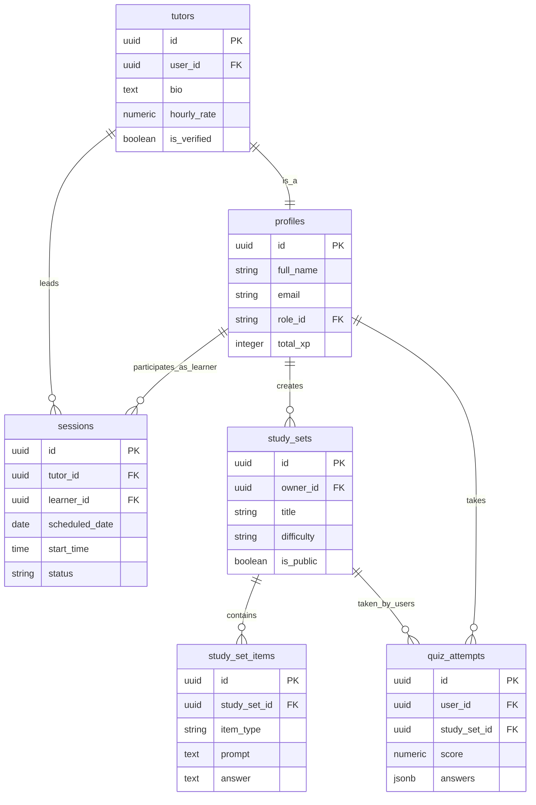

# ScholarMe Architecture

This document provides a high-level overview of the ScholarMe architecture, including system design and core database relationships.

## System Architecture

ScholarMe is built on a modern serverless stack utilizing Next.js (App Router), Supabase (PostgreSQL), and Vercel.

```mermaid
graph TD
    Client[Web Client / Browser]
    Vercel[Vercel Serverless Platform]
    NextJS[Next.js App Router]
    Supabase[Supabase Platform]
    Auth[Supabase Auth]
    DB[(PostgreSQL Database)]
    Storage[Supabase Storage]
    AI[AI Services (Vertex / GCP)]

    Client -->|HTTP / React Server Components| Vercel
    Vercel --> NextJS
    NextJS -->|Direct DB Queries / ORM| DB
    NextJS -->|Supabase Client| Auth
    NextJS -->|File Uploads| Storage
    NextJS -->|API Calls| AI
    Supabase --- Auth
    Supabase --- DB
    Supabase --- Storage
```

## Core Database Schema (ER Diagram)

This diagram highlights the most critical entities in the system, focusing on users, tutoring, and study tools. Note that the full database contains over 80 tables; this is a simplified view of the core domain.


