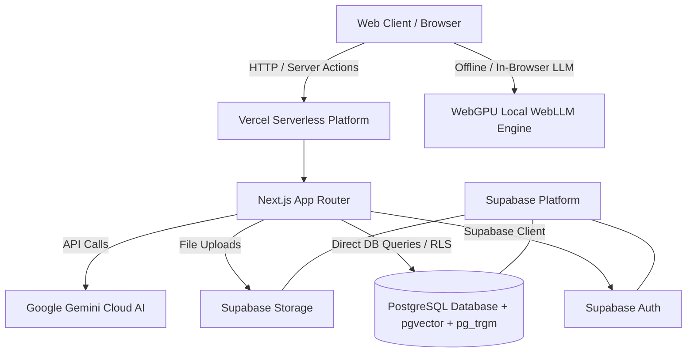
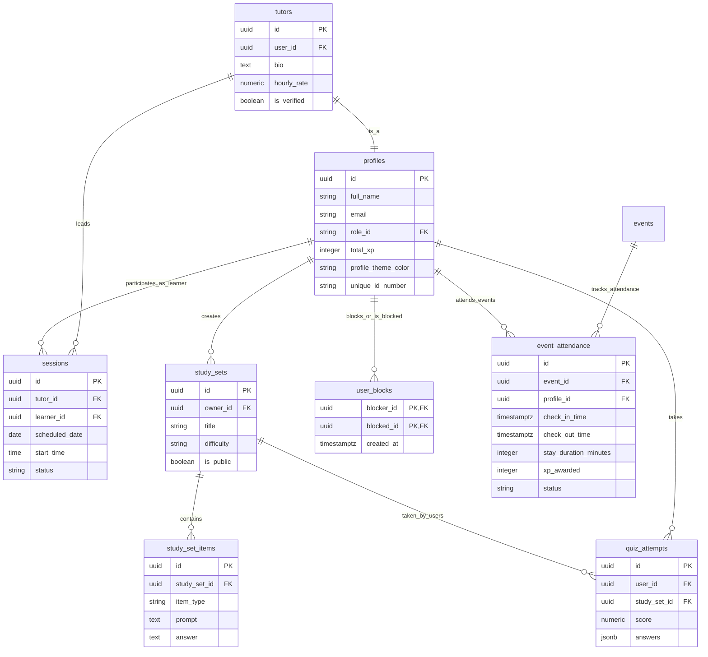

# ScholarMe Architecture

This document provides a high-level overview of the ScholarMe architecture, including system design and core database relationships.

## System Architecture

ScholarMe is built on a modern serverless stack utilizing Next.js (App Router), Supabase (PostgreSQL), and dual-tier AI processing (Google Gemini Cloud API & WebGPU Local WebLLM).

```mermaid
graph TD
    Client[Web Client / Browser]
    Vercel[Vercel Serverless Platform]
    NextJS[Next.js App Router]
    Supabase[Supabase Platform]
    Auth[Supabase Auth]
    DB[(PostgreSQL Database + pgvector + pg_trgm)]
    Storage[Supabase Storage]
    GeminiAI[Google Gemini Cloud AI]
    LocalAI[WebGPU Local WebLLM Engine]

    Client -->|HTTP / Server Actions| Vercel
    Client -->|Offline / In-Browser LLM| LocalAI
    Vercel --> NextJS
    NextJS -->|Direct DB Queries / RLS| DB
    NextJS -->|Supabase Client| Auth
    NextJS -->|File Uploads| Storage
    NextJS -->|API Calls| GeminiAI
    Supabase --- Auth
    Supabase --- DB
    Supabase --- Storage
```

## Core Database Schema (ER Diagram)

This diagram highlights the most critical entities in the system, focusing on users, tutoring, study tools, event attendance, and security.

```mermaid
erDiagram
    profiles ||--o{ sessions : participates_as_learner
    profiles ||--o{ study_sets : creates
    profiles ||--o{ user_blocks : blocks_or_is_blocked
    profiles ||--o{ event_attendance : attends_events
    tutors ||--o{ sessions : leads
    tutors ||--|| profiles : is_a
    events ||--o{ event_attendance : tracks_attendance
    study_sets ||--o{ study_set_items : contains
    study_sets ||--o{ quiz_attempts : taken_by_users
    profiles ||--o{ quiz_attempts : takes

    profiles {
        uuid id PK
        string full_name
        string email
        string role_id FK
        integer total_xp
        string profile_theme_color
        string unique_id_number
    }

    user_blocks {
        uuid blocker_id PK,FK
        uuid blocked_id PK,FK
        timestamptz created_at
    }

    event_attendance {
        uuid id PK
        uuid event_id FK
        uuid profile_id FK
        timestamptz check_in_time
        timestamptz check_out_time
        integer stay_duration_minutes
        integer xp_awarded
        string status
    }

    tutors {
        uuid id PK
        uuid user_id FK
        text bio
        numeric hourly_rate
        boolean is_verified
    }

    sessions {
        uuid id PK
        uuid tutor_id FK
        uuid learner_id FK
        date scheduled_date
        time start_time
        string status
    }

    study_sets {
        uuid id PK
        uuid owner_id FK
        string title
        string difficulty
        boolean is_public
    }

    study_set_items {
        uuid id PK
        uuid study_set_id FK
        string item_type
        text prompt
        text answer
    }

    quiz_attempts {
        uuid id PK
        uuid user_id FK
        uuid study_set_id FK
        numeric score
        jsonb answers
    }
```
